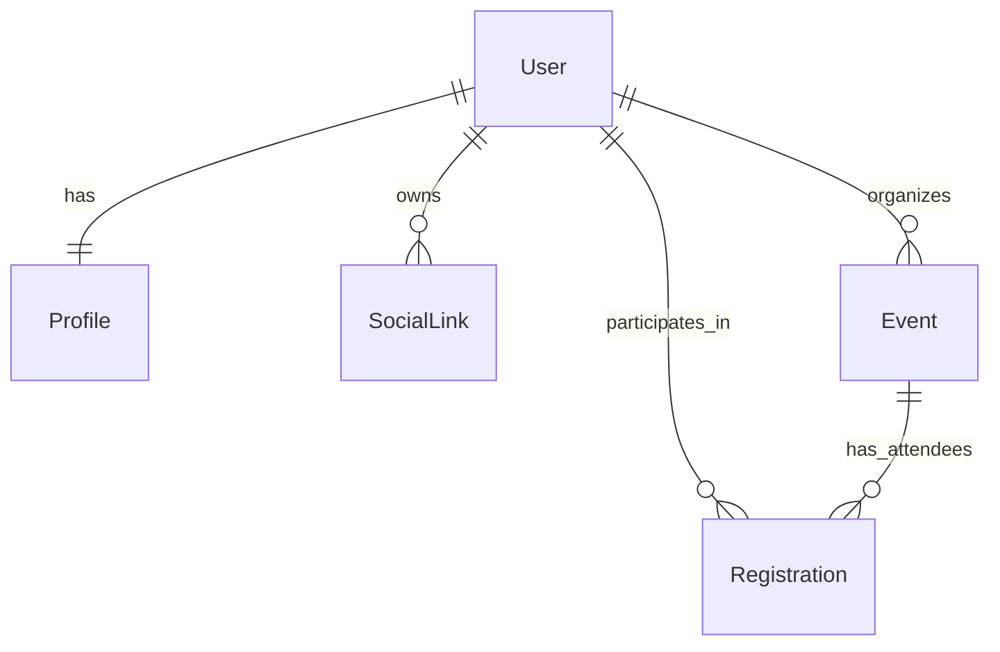

# Database Schema

Event Horizon uses a relational database (SQLite by default) managed via Django's Object-Relational Mapper (ORM).

## Core Models

### 1. Users (`users` App)

#### `User` (Django Built-in)
*   Standard authentication model.
*   **Fields:** `id`, `username`, `email`, `password`, `first_name`, `last_name`, `date_joined`.

#### `Profile`
*   Extends the User model with additional metadata.
*   **Relationship:** One-to-One with `User`.
*   **Fields:**
    *   `bio` (Text): User biography.
    *   `location` (Char): User's base/location.
    *   `phone_number` (Char): Contact info.
    *   `avatar` (Image): Profile picture.

#### `SocialLink`
*   Stores external profile links for a user.
*   **Relationship:** Many-to-One with `User` (User has many links).
*   **Fields:**
    *   `platform` (Enum): GitHub, Twitter, LinkedIn, etc.
    *   `url` (URL): The link itself.

---

### 2. Events (`events` App)

#### `Event`
*   Represents a Mission/Event.
*   **Fields:**
    *   `title` (Char): Mission codename/title.
    *   `slug` (Slug): URL-friendly unique identifier.
    *   `description` (Text): Detailed mission briefing.
    *   `start_time` (DateTime): Mission start.
    *   `end_time` (DateTime): Mission end.
    *   `location` (Char): Physical or virtual location.
    *   `capacity` (Int): Maximum number of active participants.
    *   `organizer` (FK -> `User`): The user who created the event.
    *   `registration_schema` (JSON): Custom form configuration for attendees.
        *   Example: `[{"id": "q1", "label": "Role?", "type": "text"}]`

#### `Registration`
*   Tracks a user's participation in an event.
*   **Relationship:** Links `Event` and `User`.
*   **Fields:**
    *   `status` (Enum): `registered`, `waitlisted`, `cancelled`.
    *   `answers` (JSON): Responses to the event's `registration_schema`.
        *   Example: `{"q1": "Engineer"}`
    *   `registered_at` (DateTime): Timestamp of registration.

## Relationships Diagram (Conceptual)

